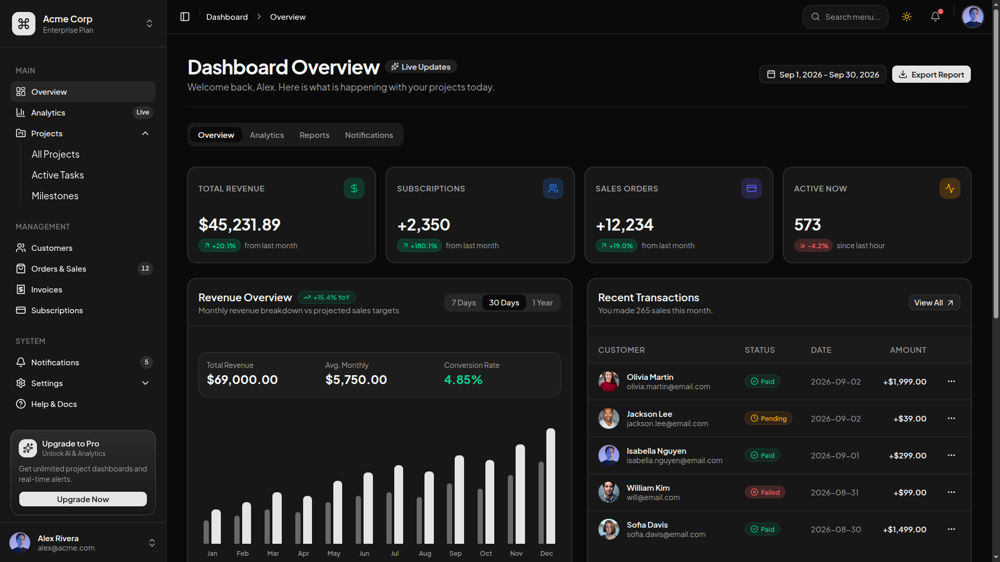

# Shadcn Dashboard

Admin dashboard built on Next.js 16 (App Router, React 19) with a shadcn/ui component set, sidebar navigation, and dark mode.



## 🚀 Tech Stack

- **Framework**: [Next.js 16](https://nextjs.org/) (App Router & React 19)
- **UI Components**: [shadcn/ui](https://ui.shadcn.com/) (base-nova style) on top of [Base UI](https://base-ui.com/)
- **Styling**: [Tailwind CSS v4](https://tailwindcss.com/)
- **Language**: [TypeScript](https://www.typescriptlang.org/)
- **Theming**: [next-themes](https://github.com/pacocoursey/next-themes) (light/dark toggle)
- **Icons**: [lucide-react](https://lucide.dev/)
- **HTTP Client**: [xior](https://github.com/suhaotian/xior) (Axios alternative)
- **State & Data Fetching**: [TanStack Query v5](https://tanstack.com/query/latest)

## ✨ Features

- **Dashboard shell**: collapsible sidebar (`app-sidebar`), header with search + breadcrumbs, theme toggle
- **Overview page**: metric cards, revenue chart, recent sales, project progress, activity feed
- **Analytics & Projects pages** under the `(dashboard-layout)` route group
- **Oxlint & Oxfmt**: Fast Rust-based linter and formatter with automated Tailwind class sorting and formatting on save
- **Husky & lint-staged**: Git pre-commit hooks that check and format staged code before committing
- **Pre-configured Providers & Utilities**:
  - `xior` HTTP client set up in `@/lib/api`
  - `QueryProvider` integrated in `@/providers/query-provider` and wrapped in `app/layout.tsx`
  - `ThemeProvider` for dark mode support
- **VS Code Settings**: Pre-configured `.vscode/settings.json` for format on save out-of-the-box

## 🛠️ Available Scripts

Using **Bun** (or your preferred package manager):

| Command                | Description                                         |
| ---------------------- | --------------------------------------------------- |
| `bun dev`              | Runs the development server                         |
| `bun run build`        | Builds the application for production               |
| `bun start`            | Starts the production server                        |
| `bun run lint`         | Runs Oxlint to check for code issues                |
| `bun run lint:fix`     | Runs Oxlint and auto-fixes issues                   |
| `bun run format`       | Formats all files using Oxfmt                       |
| `bun run format:check` | Checks code formatting                              |
| `bun run type-check`   | Runs TypeScript type checker without emitting files |

## 📁 Project Structure

```
├── app/
│   ├── (dashboard-layout)/
│   │   ├── layout.tsx        # Dashboard shell (sidebar + header)
│   │   ├── page.tsx          # Overview page
│   │   ├── analytics/        # Analytics page
│   │   └── projects/         # Projects page
│   ├── globals.css           # Tailwind CSS v4 styling
│   └── layout.tsx            # Root layout with QueryProvider & ThemeProvider
├── components/
│   ├── dashboard/            # Sidebar, header, theme toggle, overview widgets
│   ├── theme-provider.tsx    # next-themes wrapper
│   └── ui/                   # shadcn/ui primitives (button, card, table, ...)
├── lib/
│   └── api.ts                # xior HTTP client instance
├── providers/
│   └── query-provider.tsx    # TanStack Query client provider
├── .husky/                   # Git pre-commit hook
├── .oxlintrc.json            # Oxlint configuration
├── .oxfmtrc.json             # Oxfmt configuration
├── components.json           # shadcn/ui configuration
└── tsconfig.json             # TypeScript config (with @/* path alias)
```
